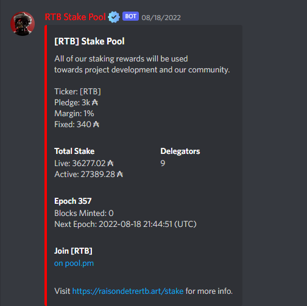
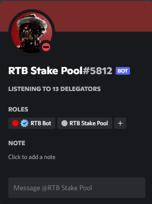

# StakePoolDiscordBot
[StakePoolDiscordBot] is a discord bot that will show you the current amount of delegators of your pool. Created with python by sebybara. 

Buy Me A Coffee: $131

How to run

1) Create your blockfrost account and get your API at https://blockfrost.io/
2) Create your discord bot at https://discord.com/developers/applications and get the bot token
3) Paste your data at credentials.py
4) pip install -r requirements.txt
5) python rtbpoolbot.py

Sample Output

